---
# Front matter
lang: ru-RU
title: "Отчет по лабораторной работе № 2. Дискреционное разграничение прав в Linux. Основные атрибуты"
subtitle: "дисциплина: Информационная безопасность"
author: "Смирнова Мария Александровна"

# Formatting
toc-title: "Содержание"
toc: true # Table of contents
toc_depth: 2
lof: false # List of figures
lot: false # List of tables
fontsize: 12pt
linestretch: 1.5
papersize: a4paper
documentclass: scrreprt
mainfont: PT Serif
romanfont: PT Serif
sansfont: PT Sans
monofont: PT Mono
mainfontoptions: Ligatures=TeX
romanfontoptions: Ligatures=TeX
sansfontoptions: Ligatures=TeX,Scale=MatchLowercase
monofontoptions: Scale=MatchLowercase
indent: true
pdf-engine: lualatex
header-includes:
  - \linepenalty=10 # the penalty added to the badness of each line within a paragraph (no associated penalty node) Increasing the value makes tex try to have fewer lines in the paragraph.
  - \interlinepenalty=0 # value of the penalty (node) added after each line of a paragraph.
  - \hyphenpenalty=50 # the penalty for line breaking at an automatically inserted hyphen
  - \exhyphenpenalty=50 # the penalty for line breaking at an explicit hyphen
  - \binoppenalty=700 # the penalty for breaking a line at a binary operator
  - \relpenalty=500 # the penalty for breaking a line at a relation
  - \clubpenalty=150 # extra penalty for breaking after first line of a paragraph
  - \widowpenalty=150 # extra penalty for breaking before last line of a paragraph
  - \displaywidowpenalty=50 # extra penalty for breaking before last line before a display math
  - \brokenpenalty=100 # extra penalty for page breaking after a hyphenated line
  - \predisplaypenalty=10000 # penalty for breaking before a display
  - \postdisplaypenalty=0 # penalty for breaking after a display
  - \floatingpenalty = 20000 # penalty for splitting an insertion (can only be split footnote in standard LaTeX)
  - \raggedbottom # or \flushbottom
  - \usepackage{float} # keep figures where there are in the text
  - \floatplacement{figure}{H} # keep figures where there are in the text
---

# Цель работы

Получение практических навыков работы в консоли с атрибутами файлов, закрепление теоретических основ дискреционного разграничения доступа в современных системах с открытым кодом на базе ОС Linux.

# Выполнение лабораторной работы

1. Используя учетную запись администратора, создадим нового пользователя guest (useradd guest) и зададим ему пароль (passwd guest) (рис. -@fig:001).

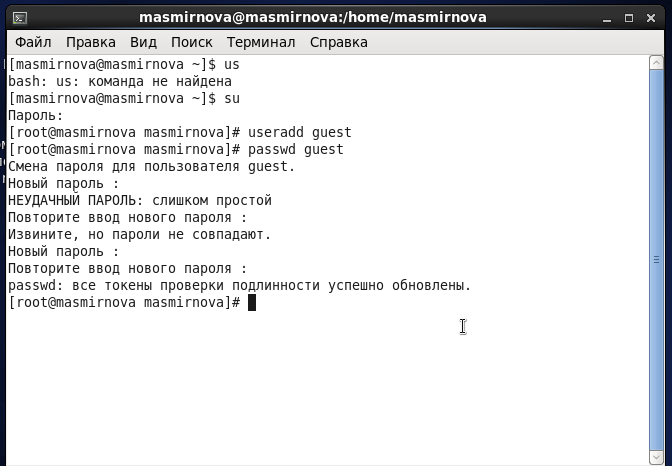{ #fig:001 width=70% }

2. Войдем в систему от имени пользователя guest (рис. -@fig:002).

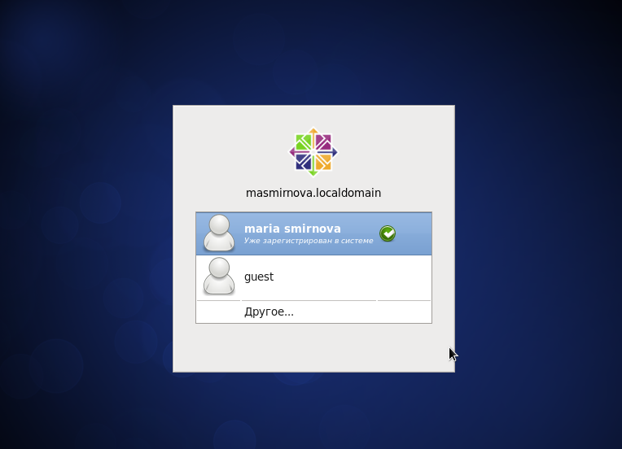{ #fig:002 width=70% }

3. С помощью команды pwd убедимся, что мы находимся в домашней директории. Уточним имя пользователя - guest - с помощью команды whoami. Посмотрим на группы, в которые входит пользователь командой id. Значения uid и gid равны 501. Вывод команды id совпадает с выводом команды groups (рис. -@fig:003).

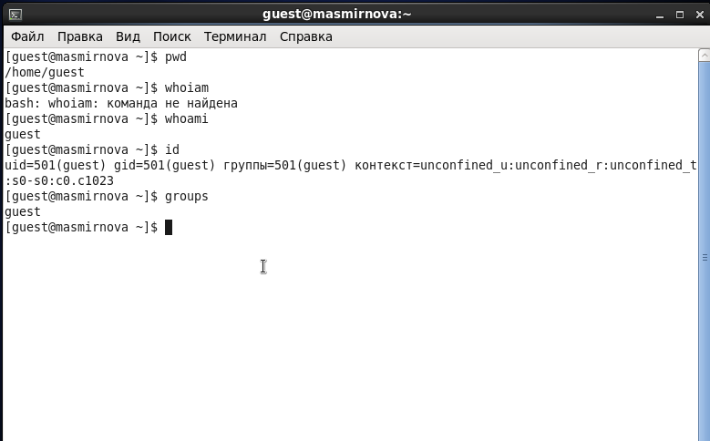{ #fig:003 width=70% }

4. Просмотрим файл /etc/passwd. Uid и gid пользователя совпадают с полученными ранее (рис. -@fig:004).

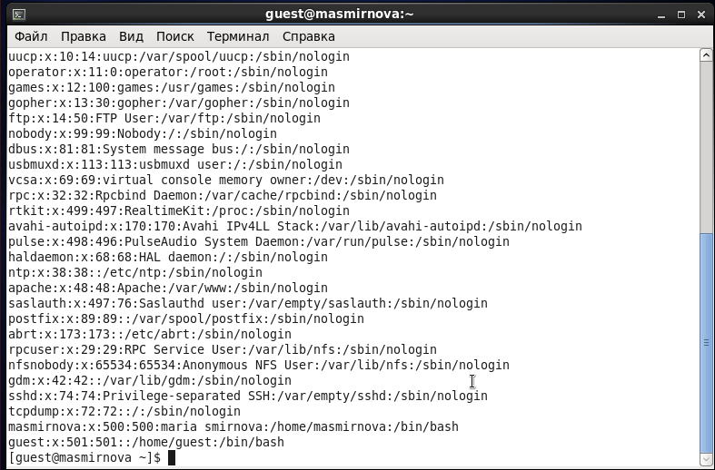{ #fig:004 width=70% }

5. Посмотрим директории в системе. Нам удалось получить список директорий пользователей masmirnova и guest. У них есть права юзера на чтение, изменение и запуск. Проверим какие расширенные атрибуты установлены на поддиректориях. Нам удалось увидеть расширенные атрибуты только директории текущего пользователя (рис. -@fig:005).

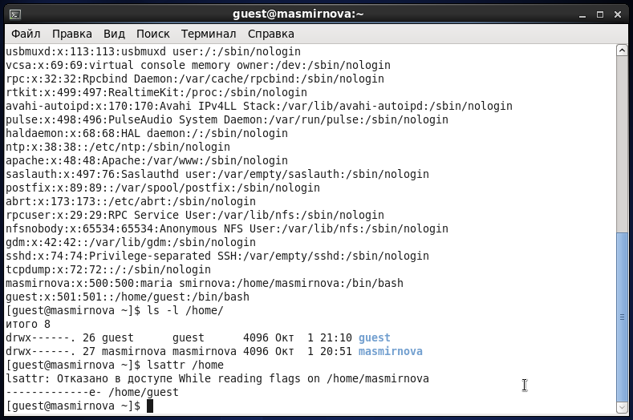{ #fig:005 width=70% }

6. Создадим в домашней директории поддиректорию dir1. Посмотрим на права доступа у каталога dir1 - чтение и запуск для всех пользователей и изменения для всех, кроме остальных пользователей. Командой lsattr посмотрим на расширенные атрибуты (рис. -@fig:006)

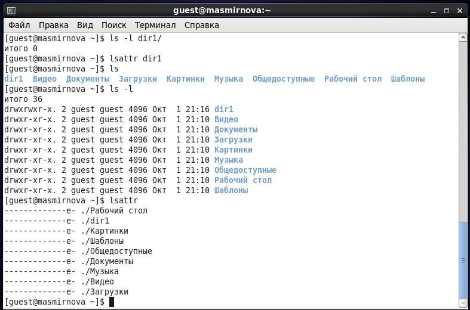{ #fig:006 width=70% }

7. Снимем с директории все атрибуты командой chmod. Проверим, что все права сняты. Попробуем создать в ней файл и увидим, что мы получили отказ из-за отсутствия прав доступа. Видим, что файл не создался.  (рис. -@fig:007)

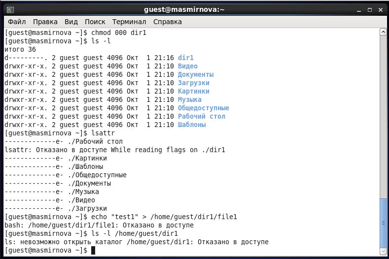{ #fig:007 width=70% }

8. Вернем директории необходимые права и убедимся, что теперь файл создался (рис. -@fig:008)

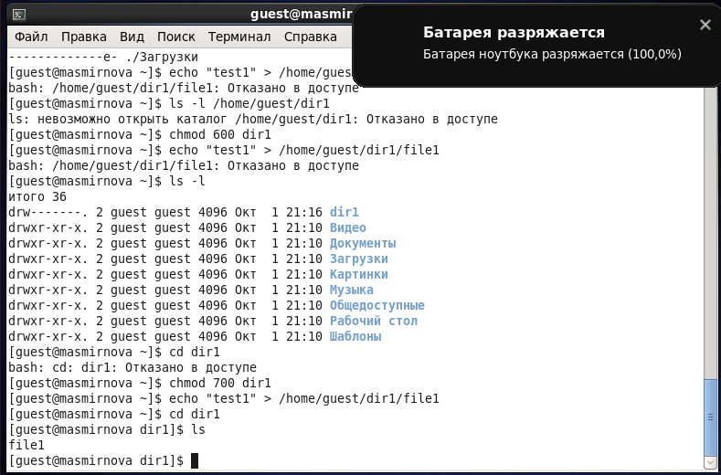{ #fig:008 width=70% }

9. Заполним таблицу "Установленные права" опытным путем (рис. -@fig:009, -@fig:010, -@fig:011,-@fig:012, -@fig:013, -@fig:014, -@fig:015).

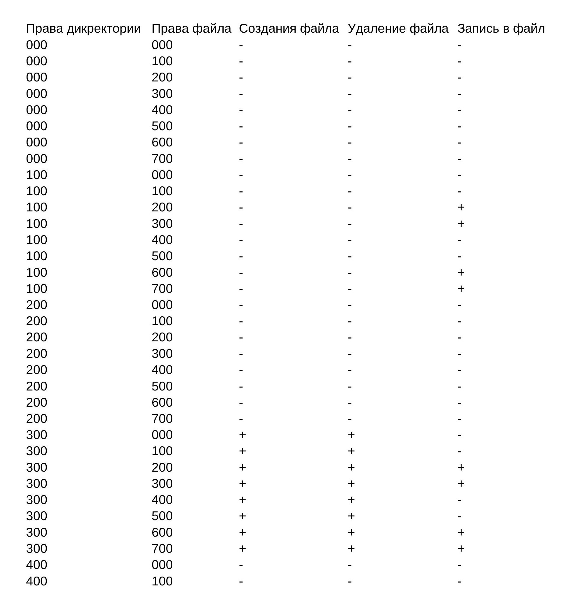{ #fig:010 width=70% }

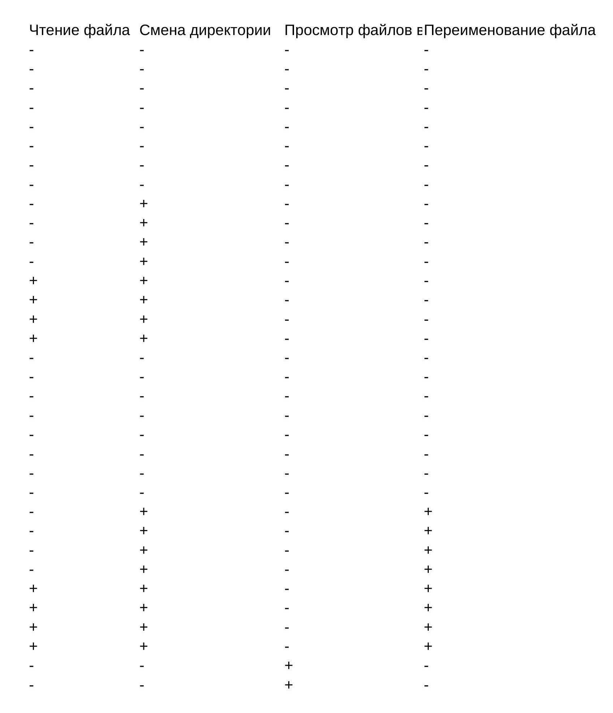{ #fig:011 width=70% }

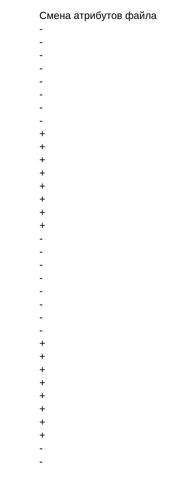{ #fig:012 width=70% }

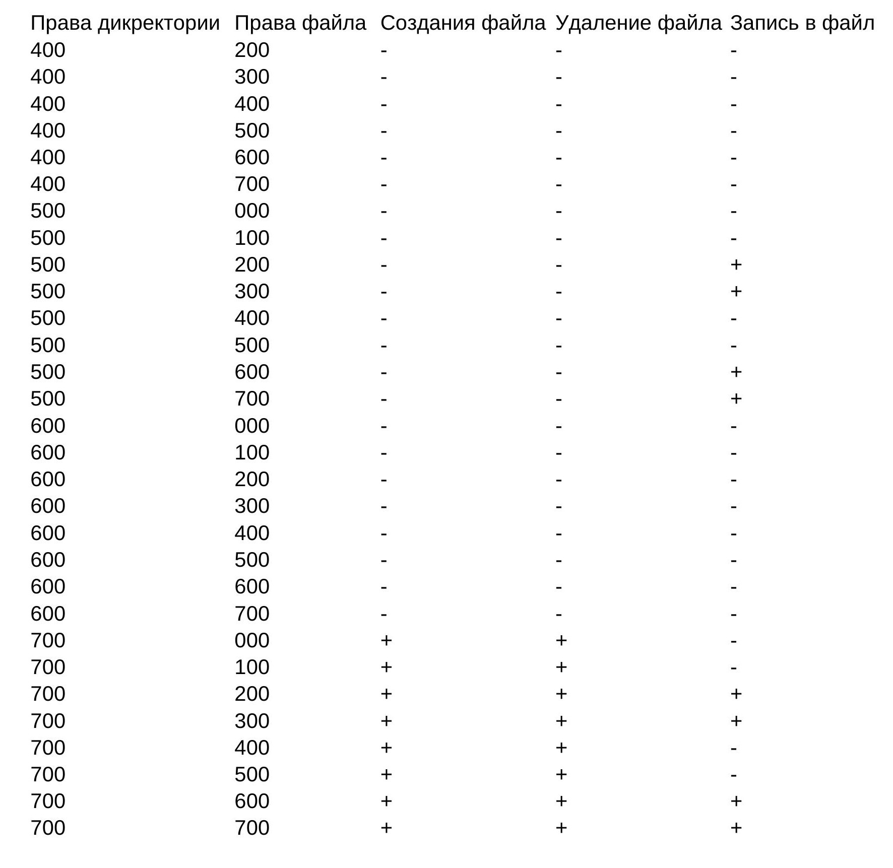{ #fig:013 width=70% }

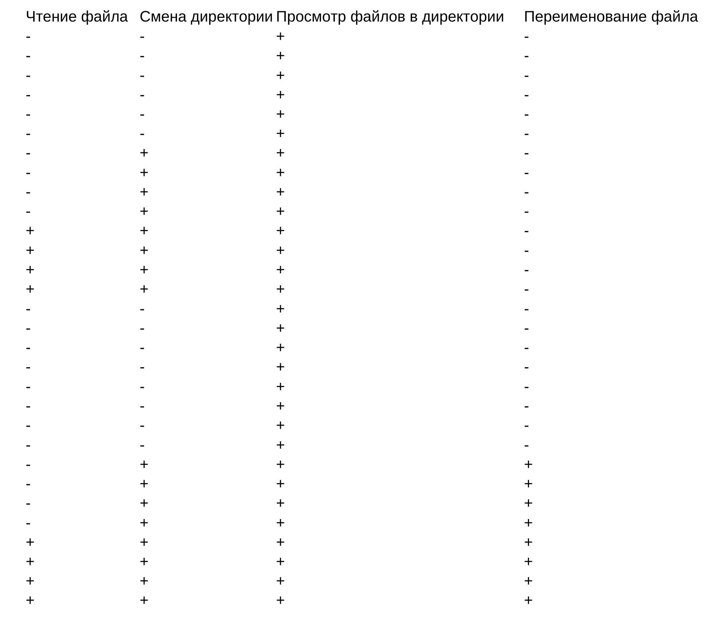{ #fig:014 width=70% }

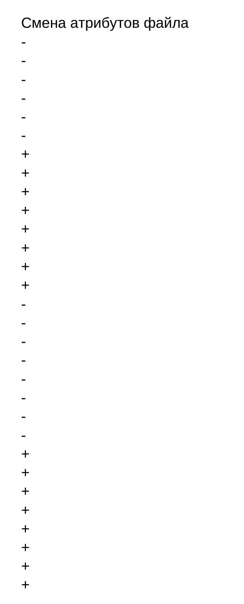{ #fig:015 width=70% }

10. Заполним таблицу "Минимальные права для совершения операций" (рис. -@fig:016).

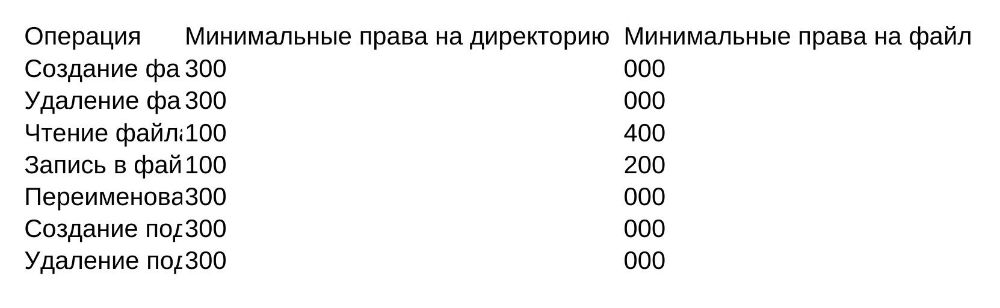{ #fig:016 width=70% }

# Выводы

В процессе выполнения лабораторной работы мы получили практические навыки работы в консоли с атрибутами файлов, закрепили теоретические основы дискреционного разграничения доступа в современных системах с открытым кодом на базе ОС Linux.