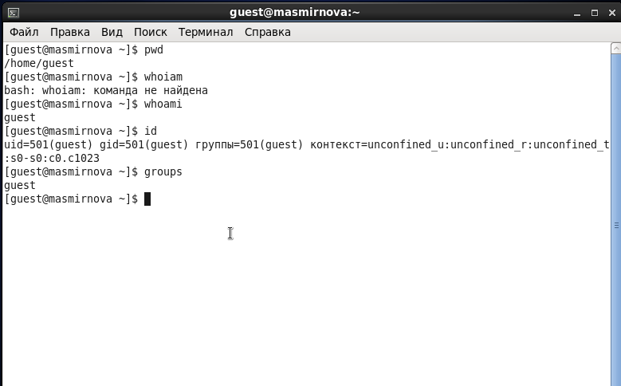
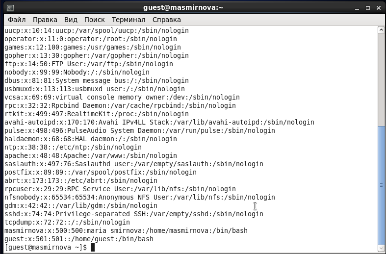
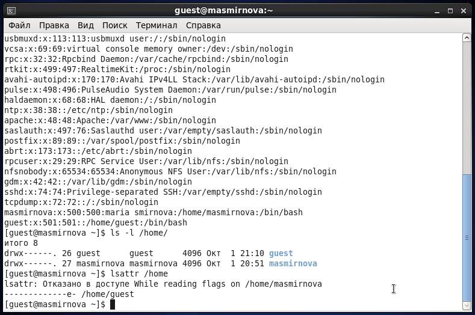
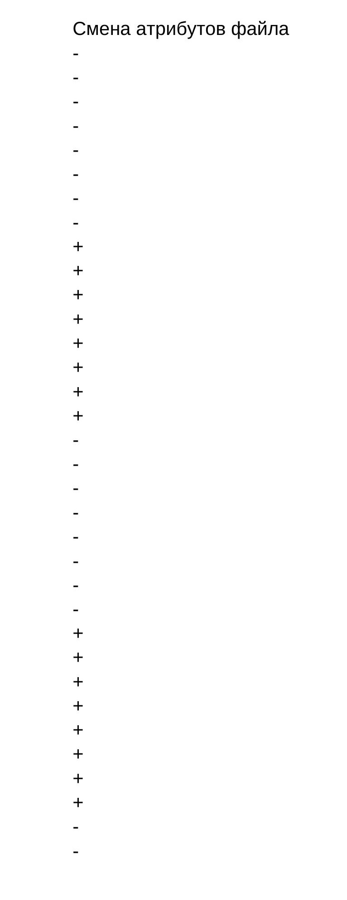
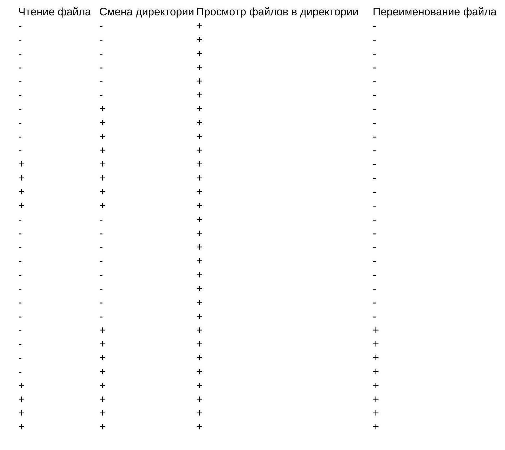

---
## Front matter
title: Защита лабораторной работы № 2. Дискреционное разграничение прав в Linux. Основные атрибуты
author: Смирнова Мария Александровна
institute: РУДН

## Formatting
toc: false
slide_level: 2
theme: metropolis
header-includes: 
 - \metroset{progressbar=frametitle,sectionpage=progressbar,numbering=fraction}
 - '\makeatletter'
 - '\beamer@ignorenonframefalse'
 - '\makeatother'
aspectratio: 43
section-titles: true
---

# Цель работы

## Цель работы

Получение практических навыков работы в консоли с атрибутами файлов, закрепление теоретических основ дискреционного разграничения доступа в современных системах с открытым кодом на базе ОС Linux.

# Выполнение лабораторной работы

## Выполнение лабораторной работы

{ #fig:001 width=70% }

## Выполнение лабораторной работы

{ #fig:002 width=70% }

## Выполнение лабораторной работы

{ #fig:003 width=70% }

## Выполнение лабораторной работы

{ #fig:004 width=70% }

## Выполнение лабораторной работы

{ #fig:005 width=70% }

## Выполнение лабораторной работы

{ #fig:006 width=70% }

## Выполнение лабораторной работы

{ #fig:007 width=70% }

## Выполнение лабораторной работы

{ #fig:008 width=70% }

## Выполнение лабораторной работы

{ #fig:010 width=70% }

## Выполнение лабораторной работы

{ #fig:011 width=70% }

## Выполнение лабораторной работы

{ #fig:012 width=70% }

## Выполнение лабораторной работы

{ #fig:013 width=70% }

## Выполнение лабораторной работы

{ #fig:014 width=70% }

## Выполнение лабораторной работы

{ #fig:015 width=70% }

## Выполнение лабораторной работы

{ #fig:016 width=70% }

# Вывод

## Вывод

В ходе лабораторной работы мы получили практические навыки работы в консоли с атрибутами файлов, закрепили теоретические основы дискреционного разграничения доступа в современных системах с открытым кодом на базе ОС Linux.
