---
# Front matter
lang: ru-RU
title: "Отчет по лабораторной работе № 3. Дискреционное разграничение прав в Linux. Два пользователя"
subtitle: "дисциплина: Информационная безопасность"
author: "Смирнова Мария Александровна"

# Formatting
toc-title: "Содержание"
toc: true # Table of contents
toc_depth: 2
lof: false # List of figures
lot: false # List of tables
fontsize: 12pt
linestretch: 1.5
papersize: a4paper
documentclass: scrreprt
mainfont: PT Serif
romanfont: PT Serif
sansfont: PT Sans
monofont: PT Mono
mainfontoptions: Ligatures=TeX
romanfontoptions: Ligatures=TeX
sansfontoptions: Ligatures=TeX,Scale=MatchLowercase
monofontoptions: Scale=MatchLowercase
indent: true
pdf-engine: lualatex
header-includes:
  - \linepenalty=10 # the penalty added to the badness of each line within a paragraph (no associated penalty node) Increasing the value makes tex try to have fewer lines in the paragraph.
  - \interlinepenalty=0 # value of the penalty (node) added after each line of a paragraph.
  - \hyphenpenalty=50 # the penalty for line breaking at an automatically inserted hyphen
  - \exhyphenpenalty=50 # the penalty for line breaking at an explicit hyphen
  - \binoppenalty=700 # the penalty for breaking a line at a binary operator
  - \relpenalty=500 # the penalty for breaking a line at a relation
  - \clubpenalty=150 # extra penalty for breaking after first line of a paragraph
  - \widowpenalty=150 # extra penalty for breaking before last line of a paragraph
  - \displaywidowpenalty=50 # extra penalty for breaking before last line before a display math
  - \brokenpenalty=100 # extra penalty for page breaking after a hyphenated line
  - \predisplaypenalty=10000 # penalty for breaking before a display
  - \postdisplaypenalty=0 # penalty for breaking after a display
  - \floatingpenalty = 20000 # penalty for splitting an insertion (can only be split footnote in standard LaTeX)
  - \raggedbottom # or \flushbottom
  - \usepackage{float} # keep figures where there are in the text
  - \floatplacement{figure}{H} # keep figures where there are in the text
---

# Цель работы

Получение практических навыков работы в консоли с атрибутами файлов для групп пользователей.

# Выполнение лабораторной работы

1. Используя учетную запись администратора, создадим нового пользователя guest2 (useradd guest2) и зададим ему пароль (passwd guest2). Добавим пользователя guest2 в группу guest. (рис. -@fig:001).

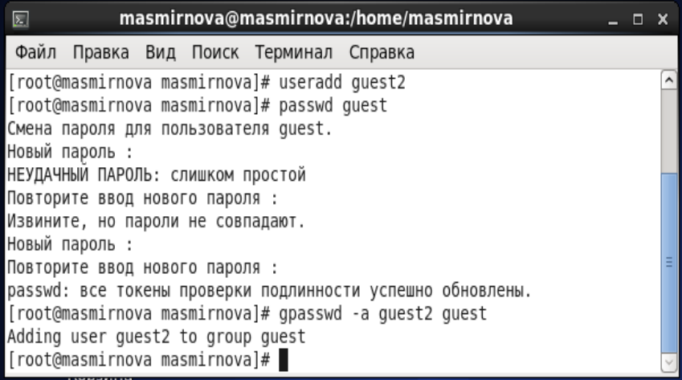{ #fig:001 width=70% }

2. Войдем в систему от двух пользователей на двух разных консолях. Для обоих пользователей определим директорию, в которой находимся (командой pwd). (рис. -@fig:002).

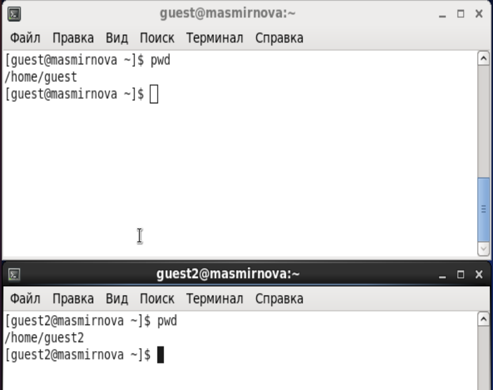{ #fig:002 width=70% }

3. Командой id уточним имя пользователей, uig, gid, и информацию о группах пользователей. Командами group guest и group guest2 определим группы, в которые входят пользователи. Увидим совпадения между нашим выводом и выводами команд id -Gn и id -G. (рис. -@fig:003).

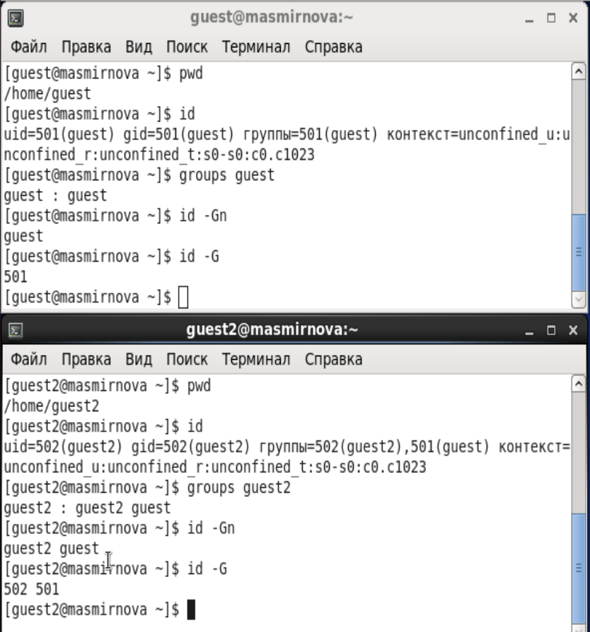{ #fig:003 width=70% }

4. Просмотрим файл /etc/passwd. Информация о пользователях совпадает с полученными ранее (рис. -@fig:004).

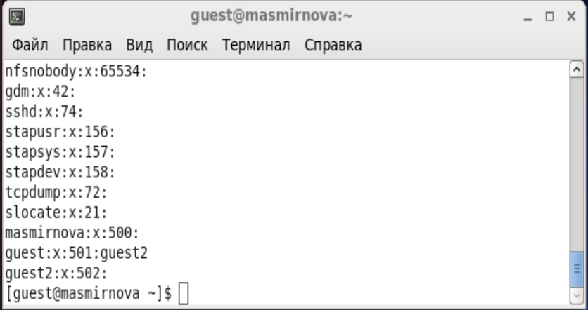{ #fig:004 width=70% }

5. От имени guest2 выполним регистрацию пользователя в группе guest (рис. -@fig:005).

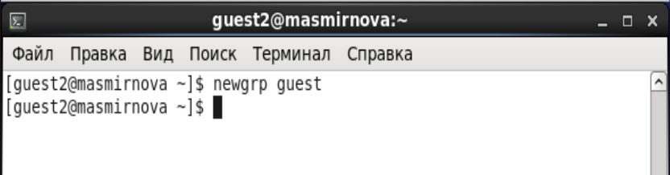{ #fig:005 width=70% }

6. От имени пользователя guest изменим права директории /home/guest ,
разрешив все действия для пользователей группы командой chmod g+rwx /home/guest. Снимем с директории /home/guest/dir1 все атрибуты командой chmod 000 dir1 (рис. -@fig:006)

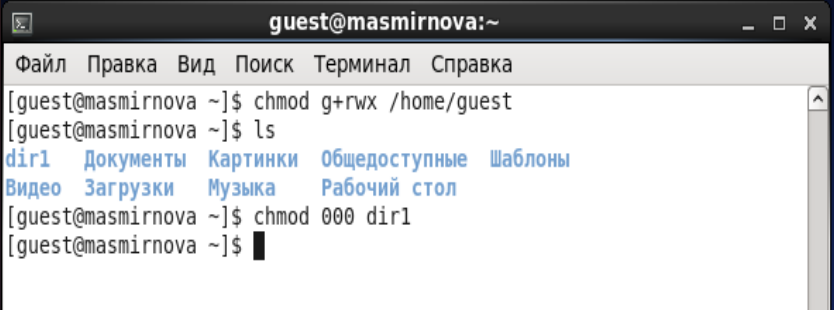{ #fig:006 width=70% }

7. Проверим правильность снятия атрибутов командой ls - l (рис. -@fig:007)

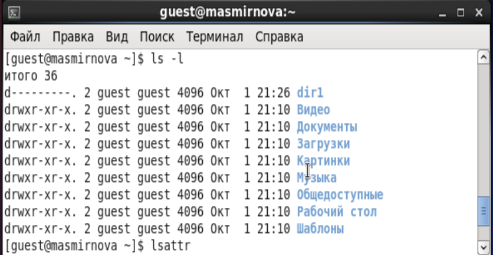{ #fig:007 width=70% }

8. И так же командой lsattr (рис. -@fig:008)

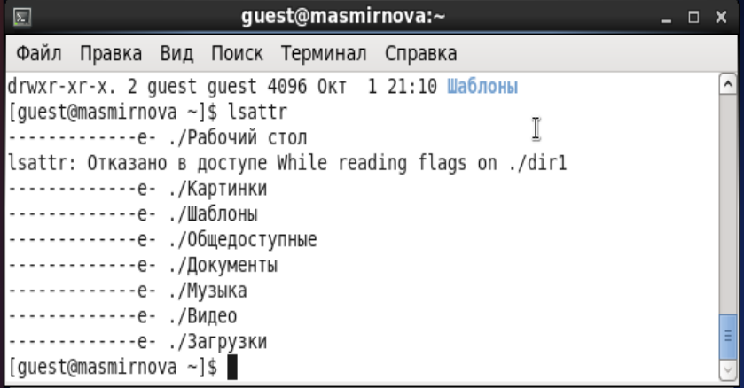{ #fig:008 width=70% }

9. Заполним таблицу "Установленные права" опытным путем (рис. -@fig:010, -@fig:011).

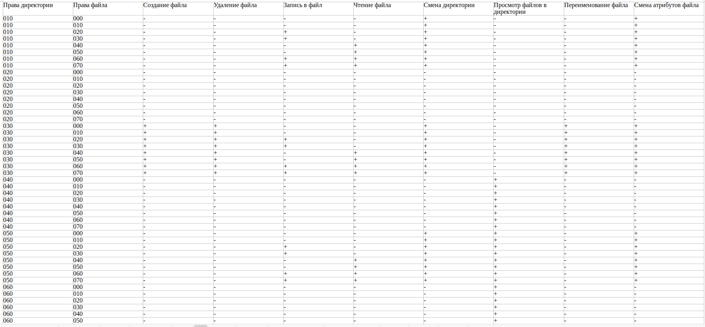{ #fig:010 width=70% }

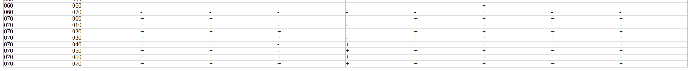{ #fig:011 width=70% }

10. Заполним таблицу "Минимальные права для совершения операций" (рис. -@fig:009).

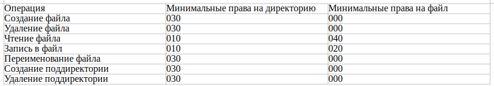{ #fig:009 width=70% }

11. Сравним таблицы, полученные сейчас, и таблицы из предыдущей лабораторной работы. Видим, что они идентичны. 

# Выводы

В процессе выполнения лабораторной работы мы получили практические навыки работы в консоли с атрибутами файлов для групп пользователей и выяснили, что пользователи из одной группы имеют одинаковые права доступа.