---
# Front matter
lang: ru-RU
title: "Отчет по лабораторной работе № 4. Дискреционное разграничение прав в Linux. Расширенные атрибуты"
subtitle: "дисциплина: Информационная безопасность"
author: "Смирнова Мария Александровна"

# Formatting
toc-title: "Содержание"
toc: true # Table of contents
toc_depth: 2
lof: false # List of figures
lot: false # List of tables
fontsize: 12pt
linestretch: 1.5
papersize: a4paper
documentclass: scrreprt
mainfont: PT Serif
romanfont: PT Serif
sansfont: PT Sans
monofont: PT Mono
mainfontoptions: Ligatures=TeX
romanfontoptions: Ligatures=TeX
sansfontoptions: Ligatures=TeX,Scale=MatchLowercase
monofontoptions: Scale=MatchLowercase
indent: true
pdf-engine: lualatex
header-includes:
  - \linepenalty=10 # the penalty added to the badness of each line within a paragraph (no associated penalty node) Increasing the value makes tex try to have fewer lines in the paragraph.
  - \interlinepenalty=0 # value of the penalty (node) added after each line of a paragraph.
  - \hyphenpenalty=50 # the penalty for line breaking at an automatically inserted hyphen
  - \exhyphenpenalty=50 # the penalty for line breaking at an explicit hyphen
  - \binoppenalty=700 # the penalty for breaking a line at a binary operator
  - \relpenalty=500 # the penalty for breaking a line at a relation
  - \clubpenalty=150 # extra penalty for breaking after first line of a paragraph
  - \widowpenalty=150 # extra penalty for breaking before last line of a paragraph
  - \displaywidowpenalty=50 # extra penalty for breaking before last line before a display math
  - \brokenpenalty=100 # extra penalty for page breaking after a hyphenated line
  - \predisplaypenalty=10000 # penalty for breaking before a display
  - \postdisplaypenalty=0 # penalty for breaking after a display
  - \floatingpenalty = 20000 # penalty for splitting an insertion (can only be split footnote in standard LaTeX)
  - \raggedbottom # or \flushbottom
  - \usepackage{float} # keep figures where there are in the text
  - \floatplacement{figure}{H} # keep figures where there are in the text
---

# Цель работы

Получение практических навыков работы в консоли с расширенными атрибутами файлов.

# Выполнение лабораторной работы

1. От имени пользователя guest посмотрим расширенные атрибуты file1. Командой chmod 600 разрешим для владельца файла чтение и запись. Попробуем установить на файл расширенный атрибут a от имени guest командой lsattr. Видим, что в выполнении операции нам отказан (рис. -@fig:001).

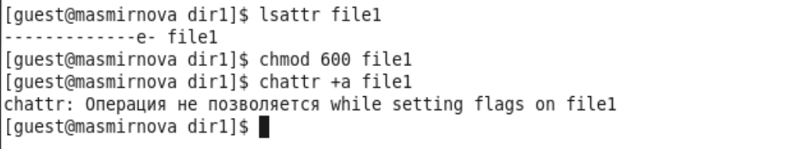{ #fig:001 width=70% }

2. Войдем в систему от имени суперпользователя. Установим расширенный атрибут a с помощью той же команды (рис. -@fig:002).

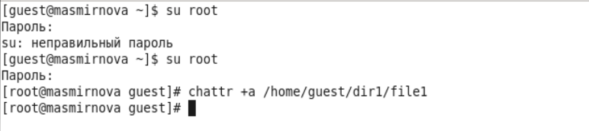{ #fig:002 width=70% }

3. Проверим, что атрибут a установился командой lsattr. Выполним дозапись слова test командой echo в наш файл. Выполним чтение файла командой cat и увидим, что слово test было успешно записано (рис. -@fig:003).

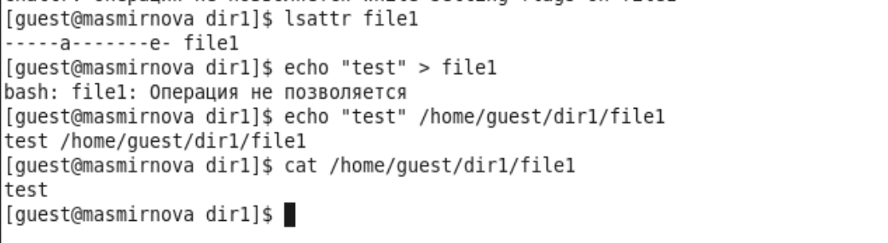{ #fig:003 width=70% }

4. Попробуем стереть информацию из файла, записав туда вместо test набор букв abcd. Попробуем переименовать файл. Попробуем установить на файл права, запрещающие чтение и запись в файл для владельца. Ни одну из операций нам выполнить не удалось (рис. -@fig:004).

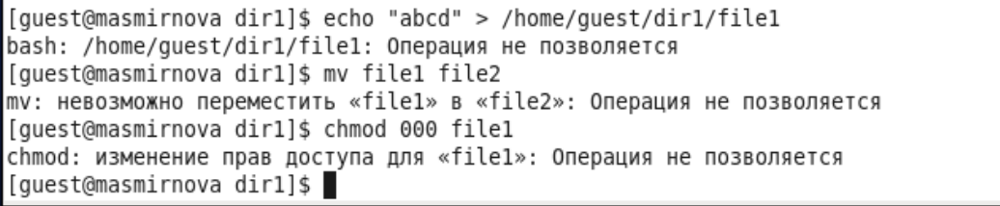{ #fig:004 width=70% }

5. Снимем расширенный атрибут a от имени суперпользователя (рис. -@fig:005).

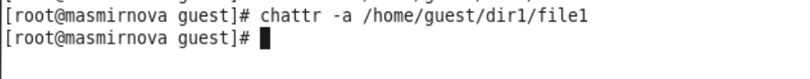{ #fig:005 width=70% }

6. Повторим все те операции, которые нам раньше не удавалось выполнить. Увидим, что теперь мы можем изменить содержимое файла, переименовать его и установить на файл запреты на чтение и запись (рис. -@fig:006)

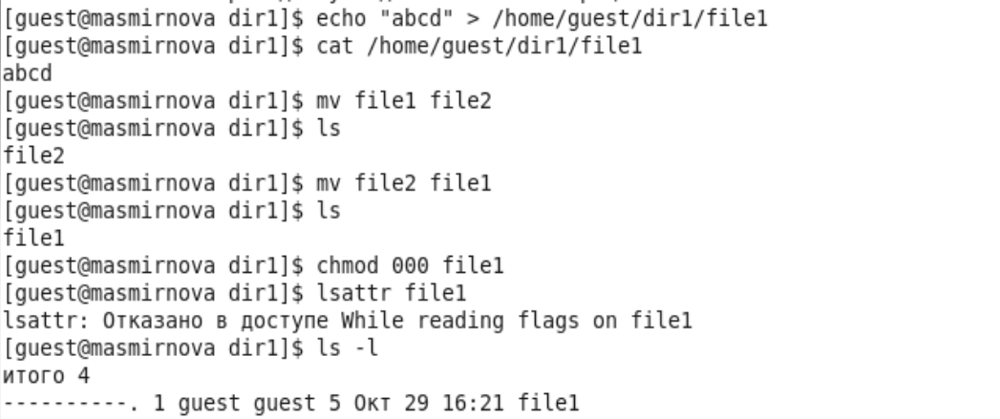{ #fig:006 width=70% }

7. Теперь установим на file1 расширенный атрибут i (рис. -@fig:007)

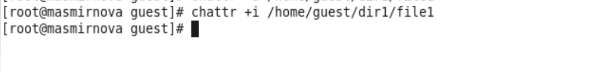{ #fig:007 width=70% }

8. Проверим правильность установки атрибута (рис. -@fig:008)

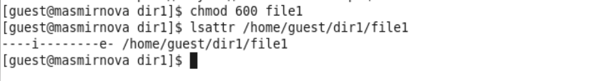{ #fig:008 width=70% }

9. Попробуем выполнить запись в файл, стереть имеющуюся информацию, переименовать файл и снять разрешение на чтение и запись. Увидим, что ни дну из операций мы выполнить не можем (рис. -@fig:009).

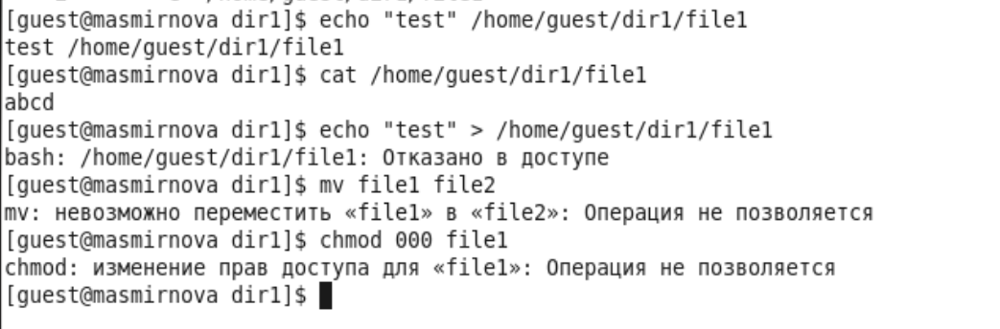{ #fig:010 width=70% }

10. Снимем расширенный атрибут i от имени суперпользователя (рис. -@fig:010)

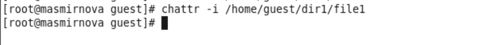{ #fig:009 width=70% }

11. Повторим все те операции, которые нам раньше не удавалось выполнить. Увидим, что теперь мы можем записать в файл, изменить содержимое файла, переименовать его и установить на файл запреты на чтение и запись (рис. -@fig:011)

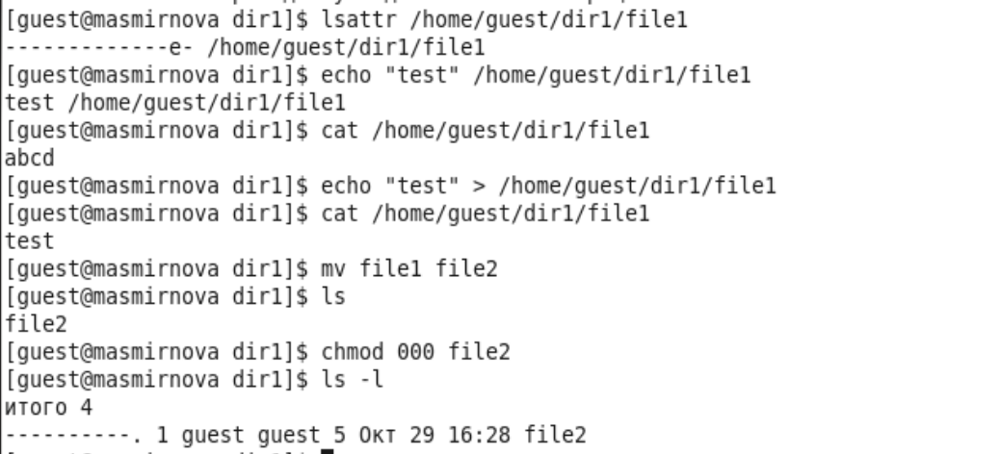{ #fig:011 width=70% }

# Выводы

В процессе выполнения лабораторной работы мы получили практические навыки работы в консоли с расширенными атрибутами файлов, опробовали действия на практике расширенных атрибутов "a" и "i". Файлы с атрибутом a можно открыть только в режиме добавления для записи. Файл с атрибутом i не может быть изменен, удалеy или переименован, его нельзя открыть в режиме записи. Оба атрибута можно установить или удалить только от имени супер пользователя.