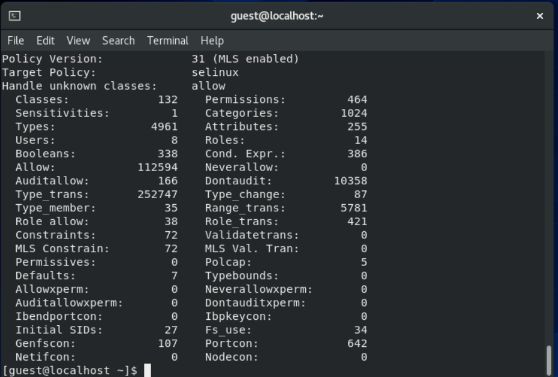
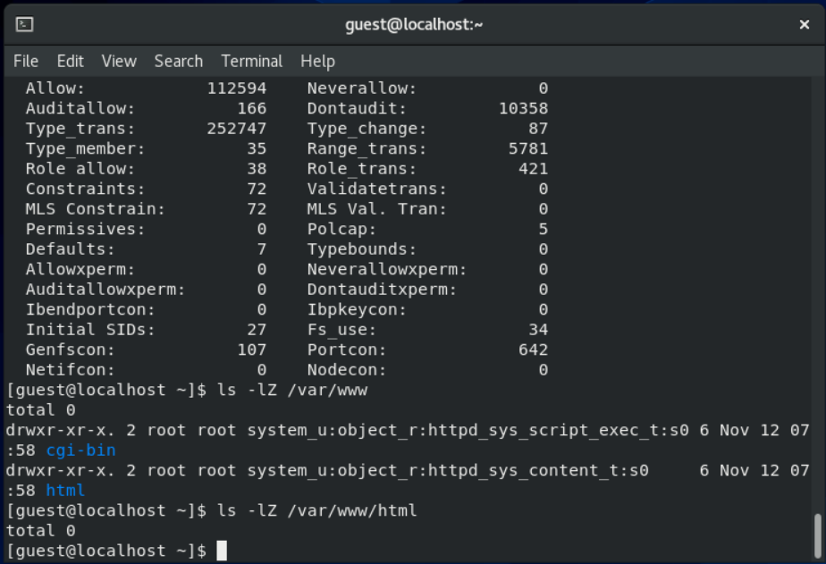
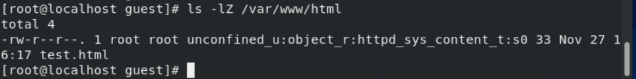
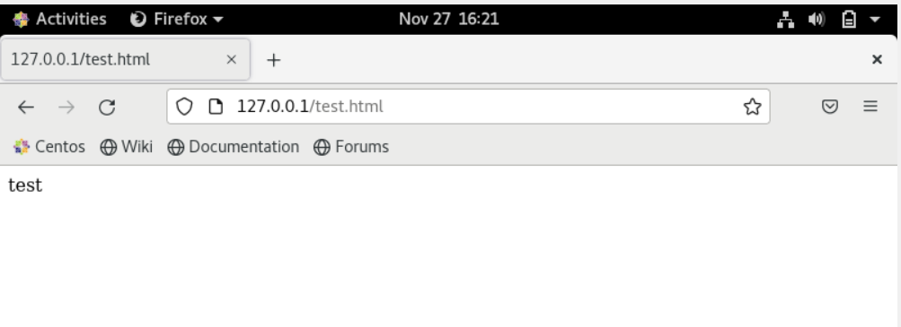
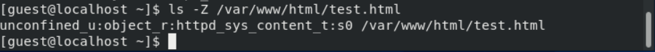
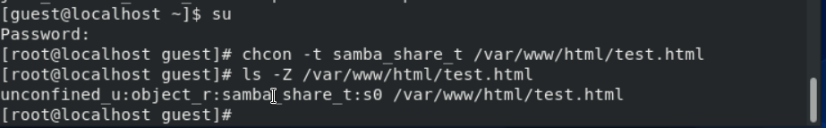
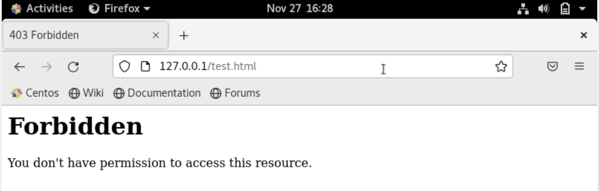
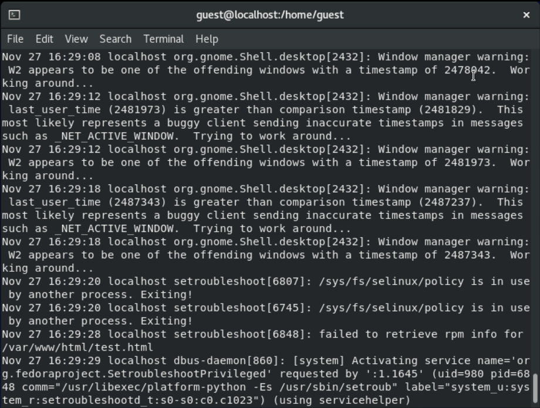
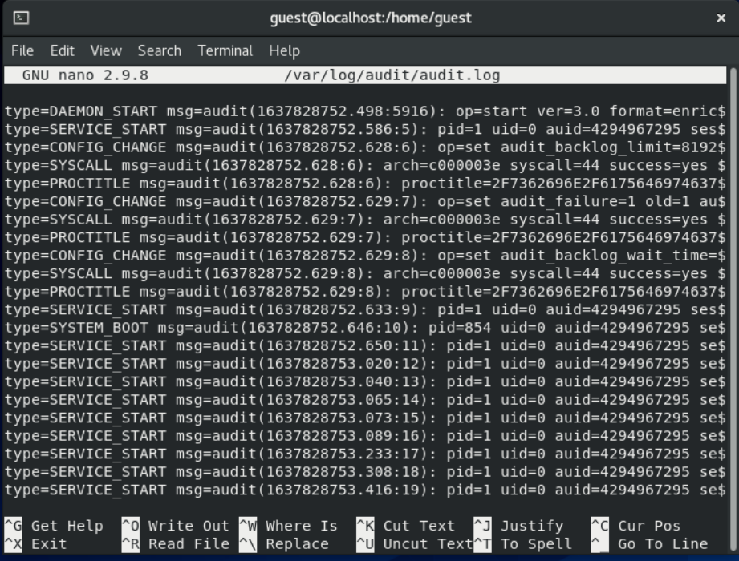

---
# Front matter
lang: ru-RU
title: "Отчет по лабораторной работе № 6. Мандатное разграничение прав в Linux"
subtitle: "дисциплина: Информационная безопасность"
author: "Смирнова Мария Александровна"

# Formatting
toc-title: "Содержание"
toc: true # Table of contents
toc_depth: 2
lof: false # List of figures
lot: false # List of tables
fontsize: 12pt
linestretch: 1.5
papersize: a4paper
documentclass: scrreprt
mainfont: PT Serif
romanfont: PT Serif
sansfont: PT Sans
monofont: PT Mono
mainfontoptions: Ligatures=TeX
romanfontoptions: Ligatures=TeX
sansfontoptions: Ligatures=TeX,Scale=MatchLowercase
monofontoptions: Scale=MatchLowercase
indent: true
pdf-engine: lualatex
header-includes:
  - \linepenalty=10 # the penalty added to the badness of each line within a paragraph (no associated penalty node) Increasing the value makes tex try to have fewer lines in the paragraph.
  - \interlinepenalty=0 # value of the penalty (node) added after each line of a paragraph.
  - \hyphenpenalty=50 # the penalty for line breaking at an automatically inserted hyphen
  - \exhyphenpenalty=50 # the penalty for line breaking at an explicit hyphen
  - \binoppenalty=700 # the penalty for breaking a line at a binary operator
  - \relpenalty=500 # the penalty for breaking a line at a relation
  - \clubpenalty=150 # extra penalty for breaking after first line of a paragraph
  - \widowpenalty=150 # extra penalty for breaking before last line of a paragraph
  - \displaywidowpenalty=50 # extra penalty for breaking before last line before a display math
  - \brokenpenalty=100 # extra penalty for page breaking after a hyphenated line
  - \predisplaypenalty=10000 # penalty for breaking before a display
  - \postdisplaypenalty=0 # penalty for breaking after a display
  - \floatingpenalty = 20000 # penalty for splitting an insertion (can only be split footnote in standard LaTeX)
  - \raggedbottom # or \flushbottom
  - \usepackage{float} # keep figures where there are in the text
  - \floatplacement{figure}{H} # keep figures where there are in the text
---

# Цель работы

Развитие навыков администрирования ОС Linux. Практическое освоение технологии SELinux. Проверка работы SELinux совместно с веб-сервером Apache.

# Выполнение лабораторной работы

1. От имени пользователя guest войдем в систему. Проверим, что SELinux работает в режиме enforcing политики targeted с помощью команд getenforce и sestatus (рис. -@fig:001).

{ #fig:001 width=70% }

2. Обратимся к веб-серверу, запущенному на нашем устройстве и проверим, что он работает (рис. -@fig:002).

{ #fig:002 width=70% }

3. Посмотрим командой ps auxZ | grep httpd список процессов и найдем в нем Apache. Посмотрим на его контекст безопасности: httpd (рис. -@fig:003).

{ #fig:003 width=70% }

4. Посмотрим на текущее состояние переключателей, большинство из них находятся в положении off (рис. -@fig:004).

{ #fig:004 width=70% }

5. Посмотрим статистику по политике с помощью команды seinfo. У нас есть 8 пользователей, 38 ролей и 35 типов (рис. -@fig:005).

{ #fig:005 width=70% }

6. Определим тип файлов в директории /var/www и /var/www/html. Круг пользователей, которым разрешено создание файлов в последней директории - root  (рис. -@fig:006)

{ #fig:006 width=70% }

7. Создадим от имени суперпользователя html-файл с содержанием из задания (рис. -@fig:007)

{ #fig:007 width=70% }

8. Проверим контекст созданного файла - httpd_sys_content_t. Это контекст по умолчанию (рис. -@fig:008)

{ #fig:008 width=70% }

9. Обратимся к созданному файлу через веб-сервер, введя в браузере http://127.0.0.1/test.html. Увидим, что файл успешно отображен (рис. -@fig:009).

{ #fig:009 width=70% }

10. Выясним, какие контексты файлов определены для httpd и сопоставим их с контекстом нашего файла test (рис. -@fig:010)

{ #fig:010 width=70% }

11. Изменим контекст файла с httpd_sys_content_t на samba_share_t (рис. -@fig:011)

{ #fig:011 width=70% }

12. Попробуем еще раз получить доступ к файлу через браузер. Получим сообщение об ошибке. Файл не был отображен из-за неправильного контекста (который мы поменяли) (рис. -@fig:012)

{ #fig:012 width=70% }

13. Посмотрим log-файлы веб-сервера Apache и системный log-файл (рис. -@fig:013)

{ #fig:013 width=70% }

14. Увидим ошибки, аналогичные указанным в файле audit.log (рис. -@fig:014)

{ #fig:014 width=70% }

15. В моем случае tcp port 81 уже есть по умолчанию в списке портов (рис. -@fig:015)

{ #fig:015 width=70% }

16. Мы также не можем его удалить. Заменим контекст обратно на корректный (рис. -@fig:016)

{ #fig:016 width=70% }

17. Наш файл через браузер снова открывается корректно. Удалим файл test.html (рис. -@fig:016)

{ #fig:016 width=70% }

# Выводы

В процессе выполнения лабораторной работы мы развили навыков администрирования ОС Linux, а также освоили технологии SELinux. Мы проверили работу SELinux совместно с веб-сервером Apache.