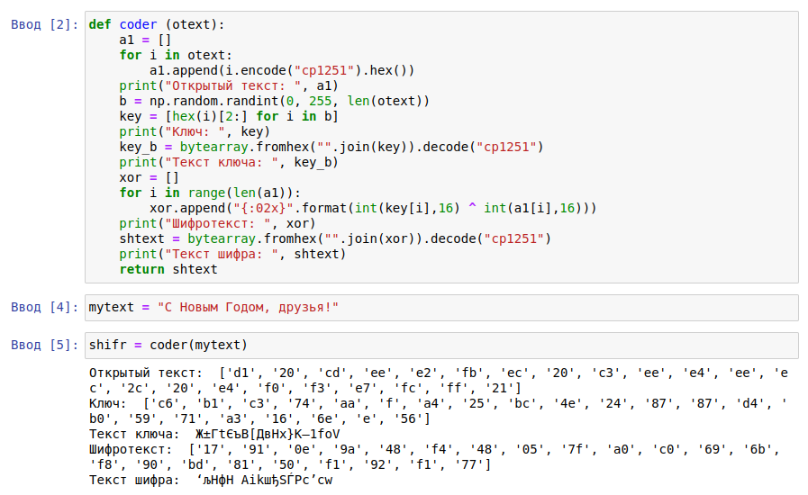

---
# Front matter
lang: ru-RU
title: "Отчет по лабораторной работе № 7. Элементы криптографии. Однократное гаммирование"
subtitle: "дисциплина: Информационная безопасность"
author: "Смирнова Мария Александровна"

# Formatting
toc-title: "Содержание"
toc: true # Table of contents
toc_depth: 2
lof: false # List of figures
lot: false # List of tables
fontsize: 12pt
linestretch: 1.5
papersize: a4paper
documentclass: scrreprt
mainfont: PT Serif
romanfont: PT Serif
sansfont: PT Sans
monofont: PT Mono
mainfontoptions: Ligatures=TeX
romanfontoptions: Ligatures=TeX
sansfontoptions: Ligatures=TeX,Scale=MatchLowercase
monofontoptions: Scale=MatchLowercase
indent: true
pdf-engine: lualatex
header-includes:
  - \linepenalty=10 # the penalty added to the badness of each line within a paragraph (no associated penalty node) Increasing the value makes tex try to have fewer lines in the paragraph.
  - \interlinepenalty=0 # value of the penalty (node) added after each line of a paragraph.
  - \hyphenpenalty=50 # the penalty for line breaking at an automatically inserted hyphen
  - \exhyphenpenalty=50 # the penalty for line breaking at an explicit hyphen
  - \binoppenalty=700 # the penalty for breaking a line at a binary operator
  - \relpenalty=500 # the penalty for breaking a line at a relation
  - \clubpenalty=150 # extra penalty for breaking after first line of a paragraph
  - \widowpenalty=150 # extra penalty for breaking before last line of a paragraph
  - \displaywidowpenalty=50 # extra penalty for breaking before last line before a display math
  - \brokenpenalty=100 # extra penalty for page breaking after a hyphenated line
  - \predisplaypenalty=10000 # penalty for breaking before a display
  - \postdisplaypenalty=0 # penalty for breaking after a display
  - \floatingpenalty = 20000 # penalty for splitting an insertion (can only be split footnote in standard LaTeX)
  - \raggedbottom # or \flushbottom
  - \usepackage{float} # keep figures where there are in the text
  - \floatplacement{figure}{H} # keep figures where there are in the text
---

# Цель работы

Освоить на практике применение режима однократного гаммирования.

# Теоретические сведения

Гаммирование представляет собой наложение (снятие) на открытые (зашифрованные) данные последовательности элементов других данных, полученной с помощью некоторого криптографического алгоритма, для получения зашифрованных (открытых) данных. Иными словами, наложение гаммы — это сложение её элементов с элементами открытого (закрытого) текста по некоторому фиксированному модулю, значение которого представляет собой известную часть алгоритма шифрования.
В соответствии с теорией криптоанализа, если в методе шифрования используется однократная вероятностная гамма (однократное гаммирование) той же длины, что и подлежащий сокрытию текст, то текст нельзя раскрыть. Даже при раскрытии части последовательности гаммы нельзя получить информацию о всём скрываемом тексте.
Наложение гаммы по сути представляет собой выполнение операции сложения по модулю 2 (XOR) (обозначаемая знаком ⊕) между элементами гаммы и элементами подлежащего сокрытию текста. Напомним, как работает операция XOR над битами: 0 ⊕ 0 = 0, 0 ⊕ 1 = 1, 1 ⊕ 0 = 1, 1 ⊕ 1 = 0.
Такой метод шифрования является симметричным, так как двойное прибавление одной и той же величины по модулю 2 восстанавливает исходное значение, а шифрование и расшифрование выполняется одной и той же программой.
Открытый текст имеет символьный вид, а ключ — шестнадцатеричное представление. Ключ также можно представить в символьном виде, воспользовавшись таблицей ASCII-кодов. К. Шеннон доказал абсолютную стойкость шифра в случае, когда однократно используемый ключ, длиной, равной длине исходного сообщения, является фрагментом истинно случайной двоичной последовательности с равномерным законом распределения. Криптоалгоритм не даёт никакой информации об открытом тексте: при известном зашифрованном сообщении C все различные ключевые последовательности K возможны и равновероятны, а значит, возможны и любые сообщения P .
Необходимые и достаточные условия абсолютной стойкости шифра:
– полная случайность ключа;
– равенство длин ключа и открытого текста;
– однократное использование ключа.

# Задание

Нужно подобрать ключ, чтобы получить сообщение «С Новым Годом, друзья!». Требуется разработать приложение, позволяющее шифровать и дешифровать данные в режиме однократного гаммирования. Приложение
должно:
1. Определить вид шифротекста при известном ключе и известном открытом тексте.
2. Определить ключ, с помощью которого шифротекст может быть преобразован в некоторый фрагмент текста, представляющий собой один из возможных вариантов прочтения открытого текста.

# Выполнение лабораторной работы

1. Подключим необходимые библиотеки (рис. -@fig:001).

{ #fig:001 width=70% }

2. Напишем функцию coder, которая будет генерировать случайный ключ и с помощью операции XOR будет шифровать открытый текст. Проверим ее работу (рис. -@fig:002).

{ #fig:002 width=70% }

3. Напишем функцию decoder, которая будет с помощью операции XOR при известном открытом тексте и шифротексте определит подходящий ключ. Проверим ее работу (рис. -@fig:003).

{ #fig:003 width=70% }

# Контрольные вопросы

1. Поясните смысл однократного гаммирования.
Это симметричный метод шифрования, смысл которого заключается в наложении последовательности элементов других данных на данные для их шифрования - наложение гаммы. По сути, это сложение элементов гаммы с открытым текстом по модулю (в нашем случае по модулю 2). Поскольку шифрование симметричное, то мы можем не только накладывать информацию для шифрования, но и снимать ее для расшифровки. Данными, необходимыми для накладывания(снятия) является открытый ключ.
2. Перечислите недостатки однократного гаммирования.
Короткую информацию, зашифрованную с помощью гаммирования, будет достаточно просто узнать. Ключ необходимо конфиденциально передавать обеим сторонам, что тоже достаточно сложно, особенно в зависимости от его длины. Также ключ необходимо менять каждый раз. И злоумышленник все равно может подобрать часть открытого текста, что может в определенных ситуациях плохо сказаться.
3. Перечислите преимущества однократного гаммирования.
Это простой и интуитивно понятный способ шифрования. Также при случайном ключе, равным по длине открытому тексту и однократно используемом, шифр является абсолютно стойким. Алгоритм не дает никакой информации об открытом тексте.
4. Почему длина открытого текста должна совпадать с длиной ключа?
Поскольку идет посимвольное шифрование. Это является условием аболютной стойкости алгоритма.
5. Какая операция используется в режиме однократного гаммирования, на-
зовите её особенности?
Операция XOR (исключающее или) или сложение по модулю 2. Главная особенность для симметричного шифрования - двойное прибавление одной и той же величины по модулю два восстанавливает исходное значение.
6. Как по открытому тексту и ключу получить шифротекст?
Сложением по модулю 2 элементы открытого текста и элементы ключа.
7. Как по открытому тексту и шифротексту получить ключ?
Повторить предыдущую операцию для открытого текста и шифротекста.
8. В чем заключаются необходимые и достаточные условия абсолютной
стойкости шифра?
- полная случайность ключа
- равенство длин ключа и открытого текста
- однократное использование ключа

# Выводы

В процессе выполнения лабораторной работы мы освоили на практике применение режима однократного гаммирования на языке python.