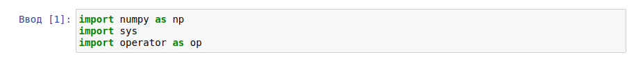
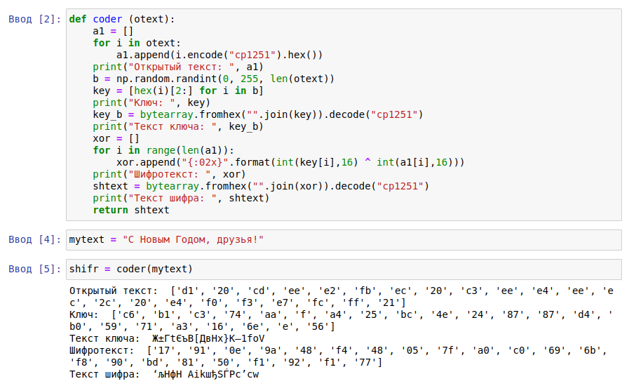
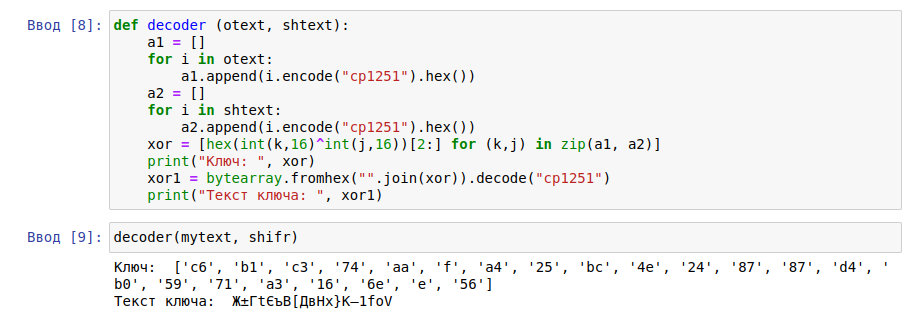

---
## Front matter
title: Защита лабораторной работы № 7. Элементы криптографии. Однократное гаммирование 
author: Смирнова Мария Александровна
institute: РУДН

## Formatting
toc: false
slide_level: 2
theme: metropolis
header-includes: 
 - \metroset{progressbar=frametitle,sectionpage=progressbar,numbering=fraction}
 - '\makeatletter'
 - '\beamer@ignorenonframefalse'
 - '\makeatother'
aspectratio: 43
section-titles: true
---

# Цель работы

Освоить на практике применение режима однократного гаммирования.

# Теоретические сведения

Гаммирование представляет собой наложение (снятие) на открытые (зашифрованные) данные последовательности элементов других данных, полученной с помощью некоторого криптографического алгоритма, для получения зашифрованных (открытых) данных. Иными словами, наложение гаммы — это сложение её элементов с элементами открытого (закрытого) текста по некоторому фиксированному модулю, значение которого представляет собой известную часть алгоритма шифрования.
Необходимые и достаточные условия абсолютной стойкости шифра:
– полная случайность ключа;
– равенство длин ключа и открытого текста;
– однократное использование ключа.

# Задание

Нужно подобрать ключ, чтобы получить сообщение «С Новым Годом, друзья!». Требуется разработать приложение, позволяющее шифровать и дешифровать данные в режиме однократного гаммирования. Приложение
должно:
1. Определить вид шифротекста при известном ключе и известном открытом тексте.
2. Определить ключ, с помощью которого шифротекст может быть преобразован в некоторый фрагмент текста, представляющий собой один из возможных вариантов прочтения открытого текста.

# Выполнение лабораторной работы

{ #fig:001 width=70% }

{ #fig:002 width=70% }

{ #fig:003 width=70% }

# Контрольные вопросы

1. Поясните смысл однократного гаммирования.
Это симметричный метод шифрования, смысл которого заключается в наложении последовательности элементов других данных на данные для их шифрования - наложение гаммы. По сути, это сложение элементов гаммы с открытым текстом по модулю (в нашем случае по модулю 2). Поскольку шифрование симметричное, то мы можем не только накладывать информацию для шифрования, но и снимать ее для расшифровки. Данными, необходимыми для накладывания(снятия) является открытый ключ.
2. Перечислите недостатки однократного гаммирования.
Короткую информацию, зашифрованную с помощью гаммирования, будет достаточно просто узнать. Ключ необходимо конфиденциально передавать обеим сторонам, что тоже достаточно сложно, особенно в зависимости от его длины. Также ключ необходимо менять каждый раз. И злоумышленник все равно может подобрать часть открытого текста, что может в определенных ситуациях плохо сказаться.
3. Перечислите преимущества однократного гаммирования.
Это простой и интуитивно понятный способ шифрования. Также при случайном ключе, равным по длине открытому тексту и однократно используемом, шифр является абсолютно стойким. Алгоритм не дает никакой информации об открытом тексте.

# Контрольные вопросы

4. Почему длина открытого текста должна совпадать с длиной ключа?
Поскольку идет посимвольное шифрование. Это является условием аболютной стойкости алгоритма.
5. Какая операция используется в режиме однократного гаммирования, на-
зовите её особенности?
Операция XOR (исключающее или) или сложение по модулю 2. Главная особенность для симметричного шифрования - двойное прибавление одной и той же величины по модулю два восстанавливает исходное значение.
6. Как по открытому тексту и ключу получить шифротекст?
Сложением по модулю 2 элементы открытого текста и элементы ключа.
7. Как по открытому тексту и шифротексту получить ключ?
Повторить предыдущую операцию для открытого текста и шифротекста.
8. В чем заключаются необходимые и достаточные условия абсолютной
стойкости шифра?
- полная случайность ключа
- равенство длин ключа и открытого текста
- однократное использование ключа

# Вывод

В процессе выполнения лабораторной работы мы освоили на практике применение режима однократного гаммирования на языке python.
