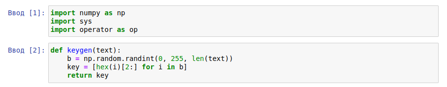

---
# Front matter
lang: ru-RU
title: "Отчет по лабораторной работе № 8. Элементы криптографии. Шифрование (кодирование) различных исходных текстов одним ключом"
subtitle: "дисциплина: Информационная безопасность"
author: "Смирнова Мария Александровна"

# Formatting
toc-title: "Содержание"
toc: true # Table of contents
toc_depth: 2
lof: false # List of figures
lot: false # List of tables
fontsize: 12pt
linestretch: 1.5
papersize: a4paper
documentclass: scrreprt
mainfont: PT Serif
romanfont: PT Serif
sansfont: PT Sans
monofont: PT Mono
mainfontoptions: Ligatures=TeX
romanfontoptions: Ligatures=TeX
sansfontoptions: Ligatures=TeX,Scale=MatchLowercase
monofontoptions: Scale=MatchLowercase
indent: true
pdf-engine: lualatex
header-includes:
  - \linepenalty=10 # the penalty added to the badness of each line within a paragraph (no associated penalty node) Increasing the value makes tex try to have fewer lines in the paragraph.
  - \interlinepenalty=0 # value of the penalty (node) added after each line of a paragraph.
  - \hyphenpenalty=50 # the penalty for line breaking at an automatically inserted hyphen
  - \exhyphenpenalty=50 # the penalty for line breaking at an explicit hyphen
  - \binoppenalty=700 # the penalty for breaking a line at a binary operator
  - \relpenalty=500 # the penalty for breaking a line at a relation
  - \clubpenalty=150 # extra penalty for breaking after first line of a paragraph
  - \widowpenalty=150 # extra penalty for breaking before last line of a paragraph
  - \displaywidowpenalty=50 # extra penalty for breaking before last line before a display math
  - \brokenpenalty=100 # extra penalty for page breaking after a hyphenated line
  - \predisplaypenalty=10000 # penalty for breaking before a display
  - \postdisplaypenalty=0 # penalty for breaking after a display
  - \floatingpenalty = 20000 # penalty for splitting an insertion (can only be split footnote in standard LaTeX)
  - \raggedbottom # or \flushbottom
  - \usepackage{float} # keep figures where there are in the text
  - \floatplacement{figure}{H} # keep figures where there are in the text
---

# Цель работы

Освоить на практике применение режима однократного гаммирования на примере кодирования различных исходных текстов одним ключом.

# Теоретические сведения

Гаммирование представляет собой наложение (снятие) на открытые (зашифрованные) данные последовательности элементов других данных, полученной с помощью некоторого криптографического алгоритма, для получения зашифрованных (открытых) данных. Иными словами, наложение гаммы — это сложение её элементов с элементами открытого (закрытого) текста по некоторому фиксированному модулю, значение которого представляет собой известную часть алгоритма шифрования.
Режим шифрования однократного гаммирования одним ключом двух видов открытого текста реализуется в соответствии со схемой, приведённой на рисунке (рис. -@fig:001)

{ #fig:001 width=70% }

Шифротексты обеих телеграмм можно получить по формулам режима однократного гаммирования:
C1 = P1 ⊕ K,
C2 = P2 ⊕ K.
Открытый текст можно найти в соответствии с приведенными формулами, зная шифротекст двух телеграмм, зашифрованных одним ключом. Для это оба равенства складываются по модулю 2. Тогда с учётом свойства операции XOR:
1 ⊕ 1 = 0,
1 ⊕ 0 = 1
получаем:
C1 ⊕ C2 = P1 ⊕ K ⊕ P2 ⊕ K = P1 ⊕ P2 .
Предположим, что одна из телеграмм является шаблоном — т.е. имеет текст фиксированный формат, в который вписываются значения полей. Допустим, что злоумышленнику этот формат известен. Тогда он получает достаточно много пар C1 ⊕ C2 (известен вид обеих шифровок). Тогда зная P1 и учитывая свойство операции XOR, имеем:
C1 ⊕ C2 ⊕ P1 = P1 ⊕ P2 ⊕ P1 = P2 .
Таким образом, злоумышленник получает возможность определить те символы сообщения P2 , которые находятся на позициях известного шаблона сообщения P1 . В соответствии с логикой сообщения P2, злоумышленник имеет реальный шанс узнать ещё некоторое количество символов сообщения P2. Затем вновь используется та же формула с подстановкой вместо P1 полученных на предыдущем шаге новых символов сообщения P2 . И так далее. Действуя подобным образом, злоумышленник даже если не прочитает оба сообщения, то значительно уменьшит пространство их поиска.

# Задание

Два текста кодируются одним ключом (однократное гаммирование). Требуется не зная ключа и не стремясь его определить, прочитать оба текста. Необходимо разработать приложение, позволяющее шифровать и дешифровать тексты P 1 и P 2 в режиме однократного гаммирования. Приложение должно определить вид шифротекстов C1 и C2 обоих текстов P1 и P2 при известном ключе; Необходимо определить и выразить аналитически способ, при котором злоумышленник может прочитать оба текста, не зная ключа и не стремясь его определить.

# Выполнение лабораторной работы

1. Подключим необходимые библиотеки и напишем функцию для генерации ключа (рис. -@fig:002).

{ #fig:002 width=70% }

2. Зададим исходные тексты (рис. -@fig:003).

{ #fig:003 width=70% }

3. Напишем функцию coder, которая с помощью операции XOR будет шифровать открытый текст. Проверим ее работу (рис. -@fig:004).

{ #fig:004 width=70% }

4. Напишем функцию decoder, которая будет с помощью операции XOR при известных шифротекстах и открытом тексте определит второй исходный текст. Проверим ее работу (рис. -@fig:005).

{ #fig:005 width=70% }

# Контрольные вопросы

### 1. Как, зная один из текстов (P1 или P2), определить другой, не зная при этом ключа?
Это наглядно показано в 4 пункте работы.

### 2. Что будет при повторном использовании ключа при шифровании текста?
Исходный текст может быть восстановлен с помощью статистического анализа двух вариантов зашифрованного текста. Важнейшим правилом криптозащиты является достаточно частая смена ключей. Причем частота может определяться исходя из длительности использования ключа или исходя из объема зашифрованного текста.

### 3. Как реализуется режим шифрования однократного гаммирования одним ключом двух открытых текстов?
Ответ представлен на схеме (рис. -@fig:006)
{ #fig:006 width=70% }

### 4. Перечислите недостатки шифрования одним ключом двух открытых текстов.
В алгоритм сложнее внести изменения и более длинные ключи. Так же снижается безопасность обоих текстов.

### 5. Перечислите преимущества шифрования одним ключом двух открытых текстов.
Небольшое число ключей для передачи, простота алгоритма, удобство для обеих сторон.

# Выводы

В процессе выполнения лабораторной работы мы освоили на практике применение режима однократного гаммирования одним ключом на языке python.