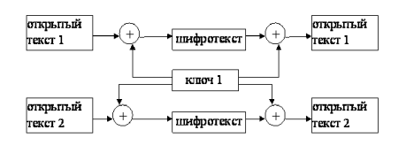
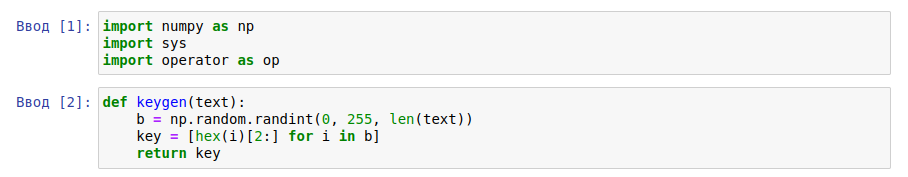
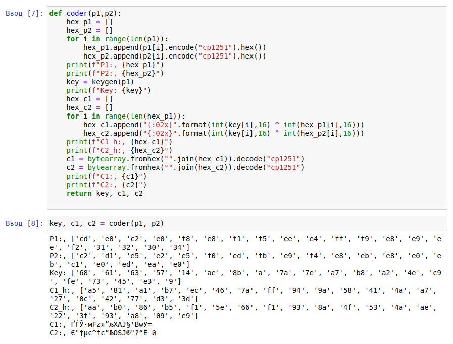
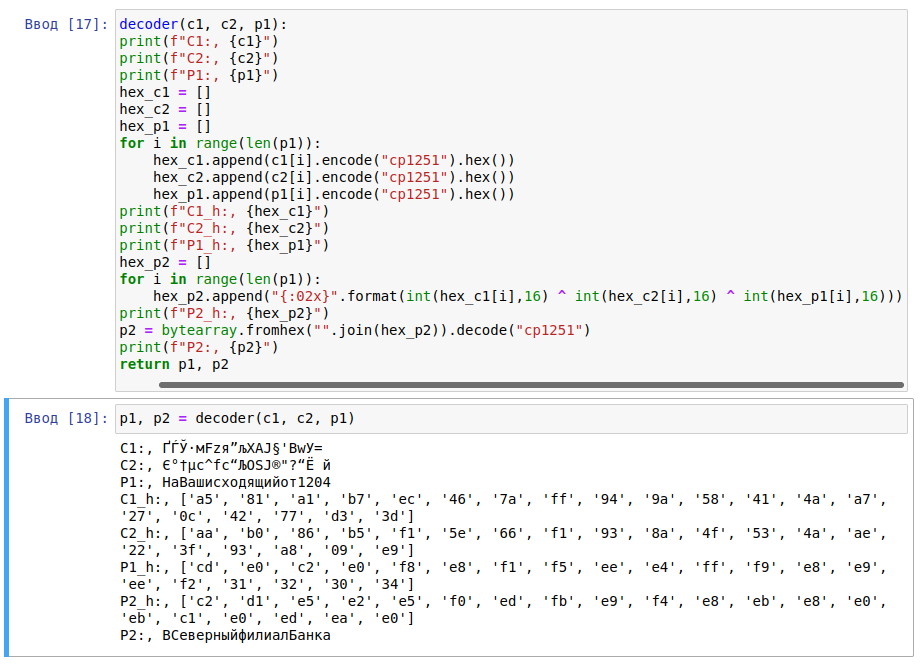

---
## Front matter
title: Защита лабораторной работы № 8. Элементы криптографии. Элементы криптографии. Шифрование (кодирование) различных исходных текстов одним ключом 
author: Смирнова Мария Александровна
institute: РУДН

## Formatting
toc: false
slide_level: 2
theme: metropolis
header-includes: 
 - \metroset{progressbar=frametitle,sectionpage=progressbar,numbering=fraction}
 - '\makeatletter'
 - '\beamer@ignorenonframefalse'
 - '\makeatother'
aspectratio: 43
section-titles: true
---

# Цель работы

Освоить на практике применение режима однократного гаммирования на примере кодирования различных исходных текстов одним ключом.

# Теоретические сведения

Гаммирование представляет собой наложение (снятие) на открытые (зашифрованные) данные последовательности элементов других данных, полученной с помощью некоторого криптографического алгоритма, для получения зашифрованных (открытых) данных. Иными словами, наложение гаммы — это сложение её элементов с элементами открытого (закрытого) текста по некоторому фиксированному модулю, значение которого представляет собой известную часть алгоритма шифрования.
Режим шифрования однократного гаммирования одним ключом двух видов открытого текста реализуется в соответствии со схемой, приведённой на рисунке (рис. -@fig:001)

# Теоретические сведения

{ #fig:001 width=70% }

# Задание

Два текста кодируются одним ключом (однократное гаммирование). Требуется не зная ключа и не стремясь его определить, прочитать оба текста. Необходимо разработать приложение, позволяющее шифровать и дешифровать тексты P 1 и P 2 в режиме однократного гаммирования. Приложение должно определить вид шифротекстов C1 и C2 обоих текстов P1 и P2 при известном ключе; Необходимо определить и выразить аналитически способ, при котором злоумышленник может прочитать оба текста, не зная ключа и не стремясь его определить.

# Выполнение лабораторной работы

{ #fig:002 width=70% }

{ #fig:003 width=70% }

{ #fig:004 width=70% }

{ #fig:005 width=70% }

# Контрольные вопросы

1. Как, зная один из текстов (P1 или P2), определить другой, не зная при этом ключа?
Это наглядно показано в 4 пункте работы.

# Контрольные вопросы

2. Что будет при повторном использовании ключа при шифровании текста?
Исходный текст может быть восстановлен с помощью статистического анализа двух вариантов зашифрованного текста. Важнейшим правилом криптозащиты является достаточно частая смена ключей. Причем частота может определяться исходя из длительности использования ключа или исходя из объема зашифрованного текста.

# Контрольные вопросы

3. Как реализуется режим шифрования однократного гаммирования одним ключом двух открытых текстов?
Ответ представлен на схеме (рис. -@fig:006)
{ #fig:006 width=70% }

# Контрольные вопросы

4. Перечислите недостатки шифрования одним ключом двух открытых текстов.
В алгоритм сложнее внести изменения и более длинные ключи. Так же снижается безопасность обоих текстов.

# Контрольные вопросы

5. Перечислите преимущества шифрования одним ключом двух открытых текстов.
Небольшое число ключей для передачи, простота алгоритма, удобство для обеих сторон.

# Выводы

В процессе выполнения лабораторной работы мы освоили на практике применение режима однократного гаммирования одним ключом на языке python.
